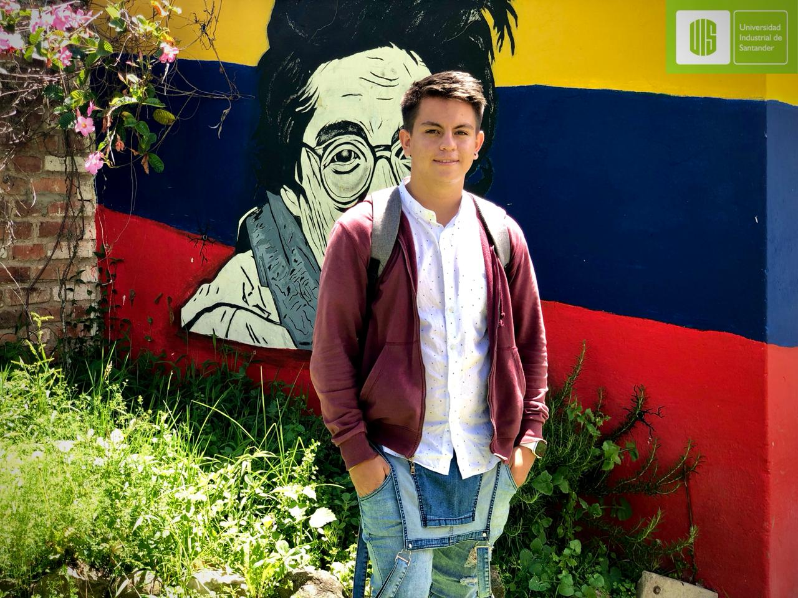
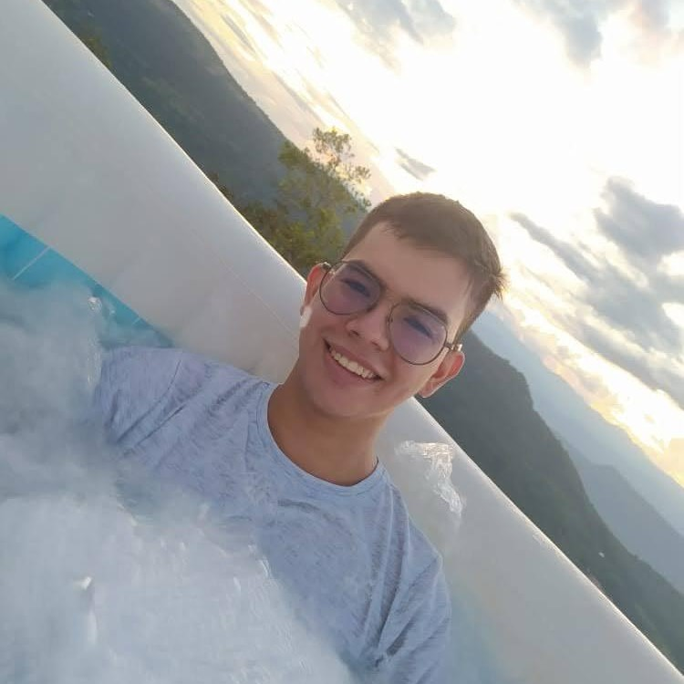
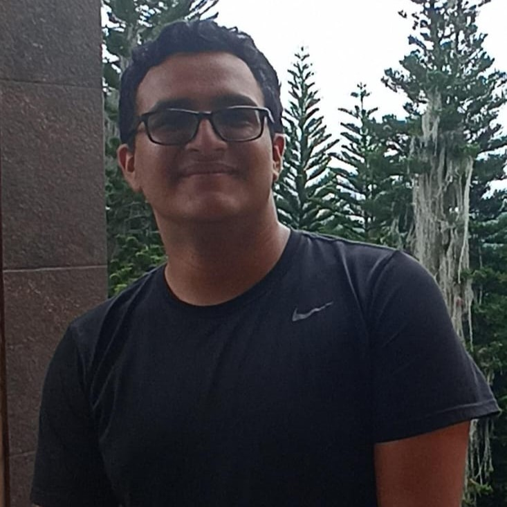
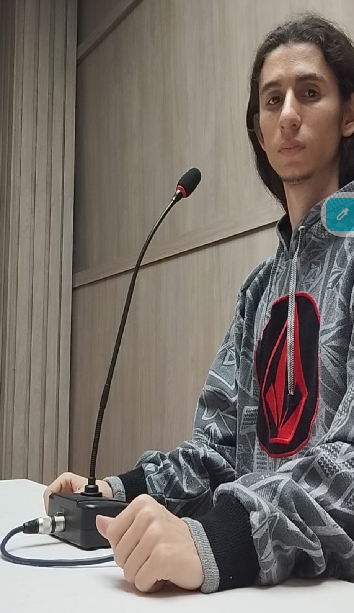
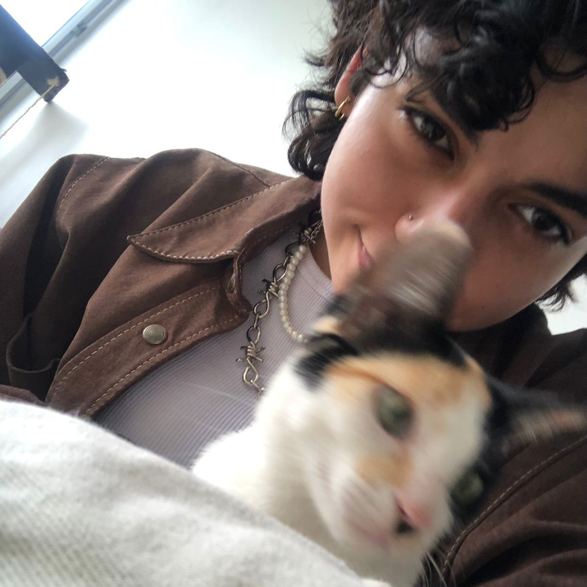

# Navi
Natus vincere, *"Nacidos para vencer"*
Grupo conformado por cinco integrantes que comparten el gusto hacia la ingeniería de sistemas; nuestro enfoque es la creatividad, compromiso y el trabajo en equipo. 

## Integrantes
- **MONGUI PIÑEROS OSCAR MAURICIO**

  
  
Estudiante de ingeniería de sistemas, fusiona su pasión por la tecnología con la creatividad. Comprometido con el desarrollo de soluciones innovadoras, cultiva valores como la disciplina y el compromiso. Apasionado por la música, encuentra en ella un equilibrio que enriquece su vida personal y profesional.

   
- **MONSALVE AYALA MILTON ANDRES**
  
  
  
 Soy creativo, dinámico y sin temor de asumir los resto de mi carrera y mi profesión, siendo capaz de proponer soluciones a problemas en pequeña y gran escala. Formulo soluciones mediante el uso de la tecnología y las matemáticas aplicadas. Tomo decisiones con base en mis principios sólidos, éticos y científicos en pro del mejoramiento social/tecnológico.

- **ORDUZ CARVAJAL CRISTIAN VLADIMIR**

  
   
Estudiante de sexto nivel de ingeniería de sistemas en la universidad industrial de Santander, presenta un especial interés en temas de inteligencia artificial y ciberseguridad, brilla especialmente en sus habilidades para la academia debido a características como su capacidad “global” en los estilos de aprendizaje. Sus valores principales son la responsabilidad, la honestidad y adaptabilidad.

  
- **ORDUZ PICON CHRISTIAN ISNARDO**

  
Estudiante de ingeniera de sistemas, con un gran interés en ciberseguridad, con conocimientos básicos en programación web, con manejo básico de lenguajes de programación como python, java y C, realizó estudios de idiomas con énfasis en Ingles en el instituto de lengua UIS, perteneciente a la selección de Tenis de Mesa UIS, distinguible por su compromiso, disciplina e integridad. Participó en conjunto con la escuela de ingeniería mecánica en el semillero de investigación de inteligencia artificial, bajo el grupo de investigación GIEMA.

  
- **PARRA ARIZA ANDREA JULIANA**

Actualmente en séptimo semestre, se distingue por la responsabilidad, compromiso y consistencia que aplica en cada tarea académica, siempre con el objetivo de enriquecer sus conocimientos y habilidades. En su tiempo libre se centra en la búsqueda constante de nuevas formas de expresión y creación, ya sea a través de la programación, la lectura o la experimentación con diferentes medios artísticos; competencias que busca aplicar en su trayectoría académica para potenciar su desarrollo profesional e integral y contribuir significativamente en los proyectos que se involucre.

  
